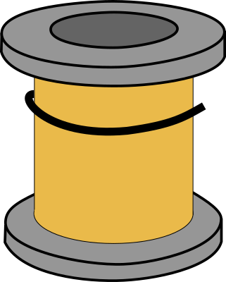

= ez-wire

Wire things together, in Clojurescript. Meant to be used together with reagent and re-frame.

* form

== dependancy

image::https://img.shields.io/clojars/v/ez-wire.svg[Clojars Project]

[source,clojure]
----
[ez-wire "0.4.1"]
----

Documentation can be found https://emil0r.github.io/ez-wire-docs/[here].

== License

Copyright © 2020 Emil Bengtsson

___
Coram Deo
